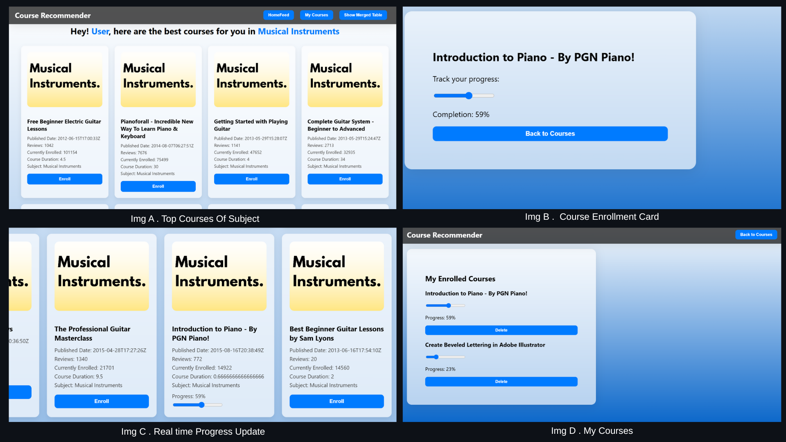

# Course Recommendation Web App

## 1. Project Title & Description

**Course Recommendation Web App**
An intelligent course recommendation system that personalizes learning paths based on <u>user interests, course completion progress, and interaction history</u>. The app dynamically recommends relevant courses, skill-based roadmaps, and related advanced technologies to enhance user upskilling journeys.

**Key Features:**

* Personalized recommendations via hybrid recommendation engine **(content-based + user progress)**
* Adaptive roadmap that adjusts suggestions based on course completion percentages
* Backend API with Flask and PostgreSQL for user and enrollment management
* React.js frontend for course selection, progress tracking, and dynamic recommendation feed
* Dockerized multi-container architecture for easy deployment and scaling
---

---

## 2. Installation Instructions

### Prerequisites

* Docker and Docker Compose installed on your machine

### Step-by-step Setup

1. **Clone the repository:**

   ```bash
   git clone https://github.com/IcodeG00D/Course-Recommendation-Web-App.git
   cd Course-Recommendation-Web-App
   ```

2. **Ensure your `.env` or environment variables are properly set for database credentials (optional if overridden in Docker Compose).**

3. **Build and start Docker containers:**

   ```bash
   docker-compose up --build
   ```

4. **Access the application:**

   * Frontend: `http://localhost:3000`
   * Backend API: `http://localhost:5000`

---

## 3. Usage Guide

* Use the frontend React app to register, select courses, and track progress.
* The backend API handles recommendations based on course completion percentages and user input.
* Example backend endpoints include:

  * `POST /recommend` — Get personalized course recommendations
  * `POST /enroll_course` — Enroll a user in a course
  * `POST /update_progress` — Update course progress percentage
  * `GET /enrollments/<user_name>` — Fetch user enrollments and progress

---

## 4. Configuration & Setup

### Environment Variables (Configured in `docker-compose.yml`)

```yaml
environment:
  DB_HOST: db
  DB_PORT: 5432
  DB_NAME: coursedb
  DB_USER: myuser
  DB_PASS: mypass
```

* The PostgreSQL container uses the above credentials to initialize the database.
* Backend connects to `db` hostname (Docker network alias).

---

## 5. Technologies Used

* **Backend:** Python, Flask, psycopg2, scikit-learn (TF-IDF & cosine similarity)
* **Frontend:** React.js
* **Database:** PostgreSQL (via official Docker image)
* **Containerization:** Docker, Docker Compose
* **Data Processing:** pandas, numpy
For more info refer attatched [Documnetation](Course_Recommend_Official_Documentation.pdf).
---

## 6. Docker & Deployment Instructions

### Docker Setup

This project uses a three-container setup orchestrated via `docker-compose.yml`:

* **db:** PostgreSQL database container
* **backend:** Flask API container
* **frontend:** React.js UI container

### Starting the containers

Run:

```bash
docker-compose up --build
```

This will build images (if not already built) and start all containers with networking configured.

### Stopping and removing containers

```bash
docker-compose down
```


---
## 7. UI Snapshots

here you can select the courses which are sorted on the basis of popularity (most enrolled).

In Img F you can see all the enrolled courses are been visible in the Database Table which means its updating the Table in Real time.

And here comes the homefeed with recommending all the courses on the basis of,
* Enrolled Course (Title and Subject).
* Most completed course (User showing interest).
* **12** courses, **5** of More Completion Progress, **4** of Less Completeion Progress, **3** other subject course (for exploratory part).
---

## 8. Contribution Guidelines

* Fork the repo and create feature branches for enhancements or fixes
* Follow PEP8 for Python backend and standard React.js practices on frontend
* Write descriptive commit messages
* Open pull requests with clear descriptions and testing instructions
* Report issues or feature requests on GitHub Issues

---

## 9. License & Legal Notices

* Dataset source: [Udemy Courses Dataset by AndrewMVd on Kaggle](https://www.kaggle.com/datasets/andrewmvd/udemy-courses)
* Comply with third-party libraries' licenses as per dependencies

---

## 10. Authors & Credits

* **Developer:** Kushagra Pathak (GitHub: [IcodeG00D](https://github.com/IcodeG00D))
* Dataset by AndrewMVd on Kaggle
* Inspired by hybrid recommendation system concepts combining content-based filtering and user progress metrics
  
* **Major Credits to :**
  * **JTP International Teams**
  * **Mr.Parit Chauhan Sir** (Head Of International Bussinesses, JTP)
  * **Mr.Jaishankar Sir** (Team Leader)
  

---


## 11. Troubleshooting & FAQs

**Q:** Backend fails to connect to the database?
**A:** Make sure the Docker `db` service is running and environment variables match in `docker-compose.yml`.

**Q:** How to update course progress?
**A:** Use the `/update_progress` API endpoint via frontend or direct API call with `user_name`, `course`, and `progress` fields.

**Q:** Recommendations seem irrelevant?
**A:** Ensure course titles in user progress data exactly match dataset course titles. Dataset loading must be successful.

**Q:** How to add more courses?
**A:** Update the `udemy_courses.csv` dataset and rebuild the backend container.


